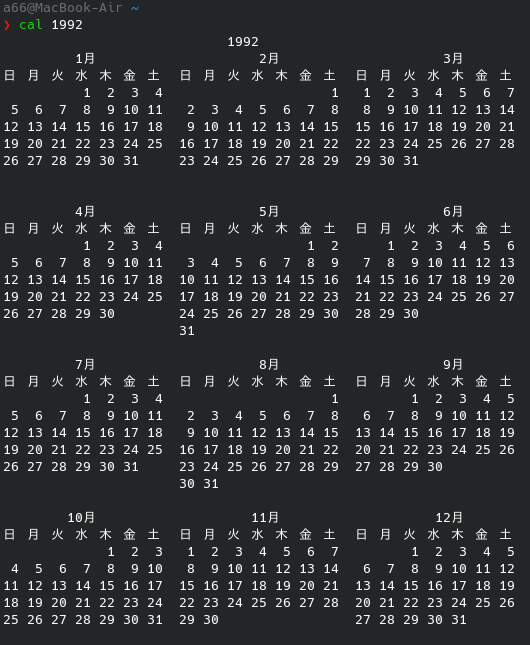

  File: 2022-08-15_告発状.md
  Size: 0               Blocks: 0          IO Block: 4096   通常の空ファイル
Device: 10306h/66310d   Inode: 15338876    Links: 1
Access: (0664/-rw-rw-r--)  Uid: ( 1000/     a66)   Gid: ( 1000/     a66)
Access: 2022-08-15 23:02:07.859232717 +0900
Modify: 2022-08-15 23:02:07.859232717 +0900
Change: 2022-08-15 23:02:07.859232717 +0900
 Birth: 2022-08-15 23:02:07.859232717 +0900

# 告発の趣旨

# 告発の事実

## 被告発人木梨松嗣弁護士と被告発人岡田進弁護士の関係

<div class="categories">
:CATEGORIES: @kanazawabengosi #金沢弁護士会 @JFBAsns 日本弁護士連合会（日弁連） #法務省 @MOJ_HOUMU #金沢地方検察庁 #被告発人岡田進弁護士 #被告発人木梨松嗣弁護士
</div>

<div class="datetime">
〉〉〉 Linux Emacs： 2022/09/06 08:06:23 〉〉〉
</div>

　これから告発状の告発の事実の記載を行ってきますが、見出しはレベル2に統一することにしました。断片的な内容になると思いますが、事実の関連性などはその都度指摘するように心がけていきたいと考えています。

　次がcalコマンドの結果になります。

  

　テキストを貼り付けPDFファイルを作成するとレイアウトが崩れていたので、パソコンの画面の矩形キャプチャーを行い、その画像を貼り付けました。1992年（平成4年）のカレンダーになります。

　平成4年4月1日の20時23分頃に金沢西警察署に出頭して、まだ暗い2日未明の時間に、ウトウトしていたところを起こされ、留置場の扉を開けて逮捕状をしめされた記憶があります。その金沢西警察署から金沢刑務所の拘置所に移送されたのが5月28日です。

　カレンダーで確認すると5月28日は木曜日で、次の月曜日は6月1日になります。公判があった6月ではないと記憶にあるので、最初で最後の被告発人岡田進弁護士の接見は5月29日の金曜日になるはずです。

　これまでに作成した「証拠資料」で被告発人岡田進弁護士の名前を含むものは次の5点になります。

```
043_第1審事件記録1／3　平成04年05月01日（午後15時00分当庁において交付した。）　送達報告書　受送達者　被告発人岡田進弁護士　金沢地方裁判所書記官　夏野博晶.pdf
045_第1審事件記録1／3　平成04年05月26日午前9時15分（受信）　電話聴取書　発信者　弁護人　被告発人岡田進弁護士　金沢地方裁判所　書記官　夏野博晶.pdf
047_第1審事件記録1／3　平成04年05月27日午後15時00分（交付送達）　受送達者　被告発人岡田進弁護士　金沢地方裁判所書記官　夏野博晶.pdf
048_第1審事件記録1／3　平成04年05月27日午後15時00分（交付送達）　弁論併合決定　受送達者　被告発人岡田進弁護士　金沢地方裁判所書記官　夏野博晶.pdf
054_第1審事件記録1／3　平成04年05月29日　請書　上記のとおりお請けしました。　上記弁護人　被告発人岡田進弁護士　金沢地方裁判所刑事部　御中.pdf
```

　上記043_で続く証拠資料ですが、PDFファイルを開いて確認すると、「送達書類　国選弁護人選任書」とありました。平成4年5月1日付となっていて、意外に早かったのだと気が付きました。

　被告発人岡田進弁護士が国選弁護人に選任されたという書面は、金沢西警察署にいた私の手元にも届いているはずですが、今回作成した「証拠資料」には含まれていないようです。ぼんやりした記憶ですが、5月の半ば以降になりそうな気がします。

　金沢西警察署での母親の面会は、13回という資料を見たか聞いた記憶があるのですが、聞いたのであれば金沢地方裁判所の公判のときになります。いつの時点から13回なのか不明ですが、金沢刑務所の拘置所での面会も合わせた数になるのかもしれません。

　早い段階で記述した書面があれば、その内容が正確だと思いますが、なにぶん30年前になるので記憶が薄れています。いつごろの面会になるのかはっきり思い出せないのですが、面会のときに母親から私選の弁護士をつけてやると言われ、それを断っていました。

　もともと弁護士に対して良い印象は持っていなかったのですが、自費で弁護士をつけることは、被害者安藤文さん家族の心証を悪くするというその場の状況判断がありました。

　しかし、なりゆきにまかせるのもよくないと考え始め、次に面会に来たとき、母親に、やはり弁護士を頼んでくれ、などと言ったのです。その場での母親の回答だったのかはっきりしませんが、今になって弁護士を変えることは裁判所の印象を悪くすると言われました。

　その時点で、弁護士の名前は聞いていなかったのですが、控訴審になってすぐに私選弁護人が決まった経緯からすると、母親に裁判所の印象を悪くすると伝えたのも被告発人木梨松嗣弁護士であったと考えられ、母親はとても納得して安心した様子でした。

　これまでも、一度決まった国選弁護人を私選の弁護人に変更することは、裁判官の印象を悪くするのかと漠然と考え、特に疑問に思うことはなかったのですが、今となるとあのときの母親の落ち着いて信頼しきった様子が気になって思い出され、洗脳状態であったとも考えられます。

　一審の段階で弁護人が私選の被告発人木梨松嗣弁護士に決まっていれば、刑事裁判の進行もずいぶん変わったものになっていたかもしれません。私は自分自身の判断で、それを断っていたので、自分で決めた選択が自業自得になったとも考えてきました。

　刑事裁判の一審と控訴審の違いの大きさは、一般には余り知られていない印象ですが、私は身を持ってその違いの大きさを実感したことになり、弁護人が完全に主導権を握る控訴審ならではの取り扱いを受けたとも考えています。

　国選弁護人というのはくじ引きのようなもので決まり、たまたま順番が来た弁護士が受けると決めれば、それで決まると聞いていました。事件を起こすまで国選と私選の違いがあるとも知らなかったですが、留置場にいるときに警察官からけっこう説明を受けていました。

　たまたまの巡り合わせで選ばれたのが、被告発人岡田進弁護士という認識でいました。被告発人岡田進弁護士に関する情報はネットで調べても乏しく、被告発人木梨松嗣弁護士との接点も不明のままです。

　唯一の被告発人岡田進弁護士に関する情報といえば、その平成4年のことですが、夏から秋の間に、北國銀行で若い行員による横領事件があり、被害額も500万円から700万円程度と比較的大きくなかった記憶ですが、北國新聞の記事に被告発人岡田進弁護士が銀行の顧問弁護士とありました。

　北國銀行は、その後、頭取とかの刑事事件があって社会問題になっていた時期もあるのですが、石川県の地元の銀行としては最大とも考えられ、平成4年当時の方が知名度も高く規模が大きかったとも考えられます。

- 北國銀行 - Wikipedia https://t.co/pU9x1sQ8zR  \n 1997年10月 - 北國銀行背任事件で当時の頭取と石川県信用保証協会幹部が逮捕される[注 2]。

　北國銀行について調べたのは今回が初めてになりそうですが、Wikipediaのページの情報は意外に少ない感じで、規模がわかりづらいとも感じました。頭取が逮捕されていたとは意外に感じましたが、時期が平成9年10月というのも意外でした。

　余り新聞を見ることのない時期でしたが、この北國銀行背任事件が、たまに新聞を開くたびにあったような記憶です。一方で、テレビニュースでの報道というのは記憶に残っておらず、北安江の借家で生活していた頃は、ご飯のときにはテレビをみていました。

- 石川銀行 - Wikipedia https://t.co/gQvKXNBOre  \n 県内金融機関の総融資量に占める石川銀行のシェアは、破綻前でも5%程度。4割を誇る北國銀行、2割の北陸銀行に大きく水をあけられ、脆弱な経営基盤であった。

　沿革の項目に、「2000年8月6日 - 預金保険法第74条第5項の規定による申出がなされ、経営が破綻」とあります。2003年に旧経営陣が逮捕とあるのですが、これも大きなニュースになっていて、この時期を確認するのが、加州相互銀行を調べた目的でした。

　大雑把な情報ですが、石川銀行の経営破綻が2000年とあるので平成14年、その前の北國銀行のシェアが4割とわかりました。ただ、石川銀行になって破綻をしていますが、そのまえの加州相互銀行の方が店舗数も規模も大きかったような印象で、北國銀行のシェアにも影響がありそうです。

　平成4年当時と平成14年当時ではいくらか違いがあると思いますが、石川県内4割のシェアを誇るという北國銀行の顧問弁護士が被告発人岡田進弁護士だったわけであります。顧問弁護士が1人とも考えにくいですが、北國新聞に名前とコメントが出ていました。

　被告発人岡田進弁護士が北國新聞の顧問弁護士として名前の出た横領事件の被告人ですが、金沢刑務所の拘置所で運動のときによく一緒になっていました。金網で囲まれた砂場のような場所をぐるぐる歩き回るような運動です。体を動かす人は少なく日光浴という感じでした。

　北國新聞の顧問弁護士という被告発人岡田進弁護士が、なぜ私の国選弁護人を引き受けたのか、本人でないとわかりようのない部分が大きいと思いますが、被告発人木梨松嗣弁護士が金沢弁護士会に働きかけたという可能性も調査の必要があると思います。

　被告発人岡田進弁護士の年齢に関する情報はネットで全く見つからないのですが、被告発人木梨松嗣弁護士よりはいくらか若い印象でした。その被告発人木梨松嗣弁護士に関しては、昭和41年辺りに金沢大学を卒業したという情報を得ています。

- 2022年09月06日07時18分の登録： H3DB_search_”岡田進弁護士”_（該当件数：2,192/データベース登録数：605,731) _2022-09-06_071808の記録 https://kk2020-09.blogspot.com/2022/09/h3dbsearch2192605731-2022-09-06071808.html
- 2022年09月06日07時19分の登録： H3DB_search_”長谷川紘之弁護士”_（該当件数：978/データベース登録数：605,731) _2022-09-06_071931の記録 https://kk2020-09.blogspot.com/2022/09/h3dbsearch978605731-2022-09-06071931.html
- 2022年09月06日07時19分の登録： H3DB_search_”木梨松嗣弁護士”_（該当件数：2,410/データベース登録数：605,731) _2022-09-06_071847の記録 https://kk2020-09.blogspot.com/2022/09/h3dbsearch2410605731-2022-09-06071847.html
- 2022年09月06日07時20分の登録： H3DB_search_”小島裕史”_（該当件数：587/データベース登録数：605,731) _2022-09-06_072034の記録 https://kk2020-09.blogspot.com/2022/09/h3dbsearch587605731-2022-09-06072034.html
- 2022年09月06日07時20分の登録： H3DB_search_”若杉幸平弁護士”_（該当件数：197/データベース登録数：605,731) _2022-09-06_071958の記録 https://kk2020-09.blogspot.com/2022/09/h3dbsearch197605731-2022-09-06071958.html
- 2022年09月06日07時21分の登録： H3DB_search_”市場急配センター”_（該当件数：2,317/データベース登録数：605,731) _2022-09-06_072124の記録 https://kk2020-09.blogspot.com/2022/09/h3dbsearch2317605731-2022-09-06072124.html
- 2022年09月06日07時21分の登録： H3DB_search_”古川龍一裁判官”_（該当件数：517/データベース登録数：605,731) _2022-09-06_072101の記録 https://kk2020-09.blogspot.com/2022/09/h3dbsearch517605731-2022-09-06072101.html
- 2022年09月06日07時22分の登録： H3DB_search_”金沢市場輸送”_（該当件数：2,204/データベース登録数：605,731) _2022-09-06_072159の記録 https://kk2020-09.blogspot.com/2022/09/h3dbsearch2204605731-2022-09-06072159.html
- 2022年09月06日07時23分の登録： H3DB_search_”金沢弁護士会”_（該当件数：6,679/データベース登録数：605,731) _2022-09-06_072233の記録 https://kk2020-09.blogspot.com/2022/09/h3dbsearch6679605731-2022-09-06072233.html

　今朝、7時18分から23分の間に、上記のまとめ記事を作成しました。

（1279／2192／605731）：ツイート
（@kk_hirono）
2018-07-17 12:23:23
> たぶん、岡田進弁護士が国選弁護人を引き受けた時点では、傷害事件だけの単純な事件だったのですが、準強姦が追起訴となり、予定されていた５月２８日の初公判が延期になりました。単独の裁判官だった川口泰司という裁判官が、陪席となって３人の裁判官による合議制となりました。
https://twitter.com/kk_hirono/status/1019060081084661760

　「北國銀行」でページ内検索を行い見かけたツイートですが、そういえば最初は傷害罪だけの起訴で、準強姦罪が追起訴となっていました。傷害は4月22日か23日付となっていたという記憶で、準強姦は、5月の20日すぎだったような記憶ですが、「証拠資料」で確認しておきます。

```
039_第1審事件記録1／3　平成04年04月21日付　起訴状（傷害）　金沢地方検察庁　検察官検事　江村正之.pdf
044_第1審事件記録1／3　平成04年05月25日付　起訴状（準強姦）　金沢地方検察庁　検察官検事　江村正之.pdf
```

　傷害罪の起訴も記憶より少し早く4月21日付でしたが、準強姦罪の起訴状が5月25日付というのは、ずいぶん遅く感じました。傷害罪では5月28日に初公判が決まっていて、追起訴で期日が取り消しになったその日に、金沢刑務所の拘置所に移送されたことはよく憶えています。

　簡単な傷害罪の国選弁護人として受けたつもりが、面倒そうな準強姦罪での追起訴となり、他の仕事もあって被告発人岡田進弁護士が慌てて狼狽した状況というのも客観的に想像できますが、これからの被告発人岡田進弁護士の対応が重要なのでさほどことではないと考えます。

　経過のおさらいをしますと、事件発生と金沢西警察署出頭が平成4年4月1日、傷害の起訴が4月21日、準強姦罪の起訴が5月25日、初公判が6月18日、結審となった第2回公判が6月30日、判決公判が8月3日になります。

　まともな審理を受けたとも思えないのですが、求刑が懲役4年で済んだのは、なりゆきにまかせたおかげだったのかもしれません。ただ、被告発人岡田進弁護士が少しでもまともな弁護をしていれば、江村正之検察官が準強姦罪の起訴を取り下げた可能性はありそうです。

　起訴の取り下げという話は聞いたことがないので、できないのかもしれません。公訴棄却を検察が求めたという話も滅多にはなさそうです。いちおう調べて確認してみます。

- 起訴取り消しとは？取り消しになる５つのケースを弁護士が解説 | 逮捕・示談に強い東京の刑事事件弁護士 https://t.co/cPSNY4oY4i  \n 【刑事訴訟法２５７条】 \n  \n 公訴は、第一審の判決があるまでこれを取り消すことができる。

　刑事訴訟法の条文はすべて読んだことがあるのですが、頭に入ったいなかったような感じです。上記のページの冒頭に、ジャーナリストの江川紹子氏も言及していたような比較的最近の事件のことがありました。

　「軍事転用可能な製品を中国に輸出したとして、機械メーカーの社長らが外為法違反で逮捕され、１年近く勾留された後、初公判の直前になって起訴を取り消されました。」という部分です。

- 江川紹子が斬る“検察の堕落”…「高知・香南官製談合事件」2度の逮捕・勾留取り消しの闇 https://t.co/xX8kut03Mm  \n 2021.11.26 18:00 \n 連載 \n 江川紹子の「事件ウオッチ」第192回

　Googleの検索で「取り消し　江川紹子」とやると出てきました。たぶん、上記の事件とは関係なさそうな気がします。「検察の堕落」というタイトル部分が気になりご紹介しました。

- “不正輸出” 起訴取り消しで計1100万円余の刑事補償 東京地裁 | NHKニュース https://t.co/YHKIDdZFnL 2021年12月9日 12時18分

〉〉〉　@kk_hironoのリツイート　〉〉〉  
- RT kk_hirono（刑事告発・非常上告＿金沢地方検察庁御中）｜amneris84（Shoko Egawa） 日時：2022-09-06 10:38／2022/09/05 23:01 URL： https://twitter.com/kk_hirono/status/1566964140266364930 https://twitter.com/amneris84/status/1566788588645150721  
> まー、こういうことを、私のような外部の人間が言うまでもなく、放送局自身が即座に言えるようになるといいな…という期待があります https://t.co/UtPJUG9xqu  

- Shoko Egawa(@amneris84)/「取り消し」の検索結果 - Twilog https://t.co/Cilhkq3qL4

〉〉〉　@kk_hironoのリツイート　〉〉〉  
- RT kk_hirono（刑事告発・非常上告＿金沢地方検察庁御中）｜amneris84（Shoko Egawa） 日時：2022-09-06 10:41／2021/12/03 16:37 URL： https://twitter.com/kk_hirono/status/1566964765502873600 https://twitter.com/amneris84/status/1466672861364764674  
> この件は起訴が取り消された、との報が入りました。引き伸ばさずに年内に処分を決めたのは、検察の唯一よかったことでした。再発防止のため、弁護人立ち合いなどの改善が必要では→江川紹子が斬る“検察の堕落”…「高知・香南官製談合事件」2度の逮捕・勾留取り消しの闇 https://t.co/gh2S7JIZ6z  

　「高知・香南官製談合事件」というのは、ほとんど記憶になかったのですが、ジャーナリストの江川紹子氏ご自身のツイートに、「この件は起訴が取り消された、との報が入りました。」と出てきました。しかし、談合事件とあるので不正輸出とは関係なさそうです。

- Shoko Egawa(@amneris84)/「不正輸出」の検索結果 - Twilog https://t.co/MWJA6JKsv2

〉〉〉　@kk_hironoのリツイート　〉〉〉  
- RT kk_hirono（刑事告発・非常上告＿金沢地方検察庁御中）｜amneris84（Shoko Egawa） 日時：2022-09-06 10:44／2021/07/31 00:38 URL： https://twitter.com/kk_hirono/status/1566965532980822016 https://twitter.com/amneris84/status/1421132984585908224  
> これは相当に問題では？１年近くも勾留しておいて、初公判直前に、法令違反でない可能性で起訴を取り消し。しかも、再捜査すると被告人負担かけるからと恩着せがましい説明。　→初公判４日前に起訴取り消し　不正輸出事件で異例の判断（産経新聞） https://t.co/srGnbu5tAa  

　みかけて印象に残っていたのは、上記の「再捜査すると被告人負担かけるからと恩着せがましい説明。」などというジャーナリストの江川紹子氏のツイートではないかと思います。談合に関しても印象に残る、東京都で別の事件があり、郷原信郎弁護士が手掛けていました。

- Shoko Egawa(@amneris84)/「談合 無罪」の検索結果 - Twilog https://t.co/E4SZE13H8h

〉〉〉　@kk_hironoのリツイート　〉〉〉  
- RT kk_hirono（刑事告発・非常上告＿金沢地方検察庁御中）｜amneris84（Shoko Egawa） 日時：2022-09-06 10:47／2019/10/07 19:56 URL： https://twitter.com/kk_hirono/status/1566966409426776065 https://twitter.com/amneris84/status/1181161329832255488  
> 弁護人は「本件での検察官控訴は、検察の一般的な実務からもかけ離れたもので、検察や警察の面子を維持することを目的とする控訴権の『私物化』であり、到底許されるものではない」と　→青梅談合事件・一審無罪判決に控訴した”過ちて改めざる”検察 #BLOGOS https://t.co/drRhFDhZ5w  

　23区以外の東京都の地名があったと記憶にあったのですが、この青梅談合事件になりそうです。東京都のどのあたりかわからないですが、青梅市というのがあったと思います。

- Shoko Egawa(@amneris84)/「青梅談合事件」の検索結果 - Twilog https://t.co/tGw9APVNX6

〉〉〉　@kk_hironoのリツイート　〉〉〉  
- RT kk_hirono（刑事告発・非常上告＿金沢地方検察庁御中）｜amneris84（Shoko Egawa） 日時：2022-09-06 10:50／2019/10/07 19:45 URL： https://twitter.com/kk_hirono/status/1566967148572209152 https://twitter.com/amneris84/status/1181158575520903169  
> 専門家の分かりやすい解説。「公共契約について、裁判所は学んだが、検察は学ばなかった」「談合の事実を全面否認していた被告人が、『人質司法』によって、有罪側に『堕ちる』寸前だった」と。学ばない検察は控訴→青梅談合事件無罪判決を読む 〜 なぜ検察は完敗したのか https://t.co/k0y1EUv4jI  

- 青梅談合事件無罪判決を読む 〜 なぜ検察は完敗したのか | アゴラ 言論プラットフォーム https://t.co/aY1NLBtPyr 楠 茂樹 上智大学法学部国際関係法学科教授

　専門家というのは郷原信郎弁護士の記事かと思ったのですが、ページを開くと別の名前が出てきて、弁護士ではない大学教授でした。ページの下にプロフィールがありますが、弁護士の資格は見当たりません。

- 青梅「談合」事件で東京高裁が逆転有罪判決・「誰を信じてこの国で生きていけば…」と被告側は絶句（江川紹子） - 個人 - Yahoo!ニュース https://t.co/80kEcUFVtn

　記事の最後までスクロールして、ジャーナリストの江川紹子氏の記事だと気が付いたのですが、逆転有罪判決が出ていたと確認しました。上告するようなことが書いてありますが、郷原信郎弁護士のTwitterでもこの青梅談合事件は全く情報を見かけなくなっています。

- 青梅談合、逆転有罪確定へ　元建設業協会長に罰金刑 - 産経ニュース https://t.co/Y75LUwZqlh 2021/2/20 16:44 \n 最高裁第１小法廷（山口厚裁判長）は、東京都青梅市発注の工事をめぐり、談合罪に問われた

　2021年2月20日の記事に、最高裁で有罪判決確定とありました。

<div class="datetime">
〈〈〈 2022/09/06 11:01:40 Linux Emacs： 〈〈〈 
</div>

## 被告発人木梨松嗣弁護士と被告発人大網健二の関係（001）：本件刑事告発・非常上告事件における重要性、連載化エントリーの意義

<div class="categories">
:CATEGORIES: @kanazawabengosi #金沢弁護士会 @JFBAsns 日本弁護士連合会（日弁連） #法務省 @MOJ_HOUMU #金沢地方検察庁 #被告発人木梨松嗣弁護士 #被告発人大網健二
</div>

<div class="datetime">
〉〉〉 Linux Emacs： 2022/09/06 11:24:09 〉〉〉
</div>

```
make_kk_topic-No.py --start_no 1 --end_no 20 --ttext 被告発人木梨松嗣弁護士と被告発人大網健二の関係|xsel -b
```

　上記の自作コマンドを実行し、20の連載エントリーの見出しを作成しました。この被告発人木梨松嗣弁護士と被告発人大網健二に関しては個別に取り上げることなく、一体化した取り扱いとして事実関係を記録します。

　過去のデータの管理が悪かったので、正確な把握が出来ていませんが、被告発人木梨松嗣弁護士と被告発人大網健二は比較的最近になって被告発人あるいは被告訴人に加えています。内容は未確認ですが、それらしい書面を1つは見つけてあるので、それが最初になるのかもしれません。

- 079_平成17年05月05日付　告発状　金沢地方検察庁御中　44頁.pdf
- 081_平成18年10月02日付　告訴状　金沢地方検察庁御中＿15頁.pdf

　今、告発状と告訴状と別になっていることに気が付き、いずれも被告発人大網健二の名前があるものの被告発人木梨松嗣弁護士ら弁護士や元裁判官は名前がないことを確認しました。平成17年と18年ですが、当時インターネットで公開していた書面になるという考えでいます。

　このあと個別に取り上げていく予定ですが、宮下浩検事の処分通知書のある告訴状が、被告発人木梨松嗣弁護士ら弁護士や元裁判官を被告訴人にした最初の刑事告訴になるのかもしれません。現在の「証拠資料」に含まれていないことも確認しました。

- 099_平成06年03月08日付　処分通知書　金沢地方検察庁　検察官　平成5年12月28日付告訴.pdf
- 100_平成29年03月31日付　処分通知書　金沢地方検察庁　検察官検事　宮下浩　被疑者　被告発人木梨松嗣他.pdf

　他にあるファイルをコピーして上記の2つのPDFファイルを「証拠資料」に追加しました。

<div class="datetime">
〈〈〈 2022/09/06 14:16:06 Linux Emacs： 〈〈〈 
</div>

## 被告発人木梨松嗣弁護士と被告発人大網健二の関係（002）：2022年9月6日に初めて知った珠洲市三崎町のイルカの「すずちゃん」

<div class="categories">
:CATEGORIES: @kanazawabengosi #金沢弁護士会 @JFBAsns 日本弁護士連合会（日弁連） #法務省 @MOJ_HOUMU #金沢地方検察庁 #被告発人木梨松嗣弁護士
</div>

<div class="datetime">
〉〉〉 MacBook-Air VSCode： 2022-09-07 16:21:41 〉〉〉  
</div>

　昨夜の何時頃か憶えていないですが、このところブラウザのタブで開いたままにしているGoogleニュースで知ったように思います。

〉〉〉　@kk_hironoのリツイート　〉〉〉  
- RT kk_hirono（刑事告発・非常上告＿金沢地方検察庁御中）｜hirono_hideki（刑事告発・非常上告＼金沢地方検察庁御中） 日時：2022-09-07 16:29／2022/09/06 20:19 URL： https://twitter.com/kk_hirono/status/1567414651801206785 https://twitter.com/hirono_hideki/status/1567110193405915139  
> » 福井のかみつきイルカ、珠洲の「すずちゃん」か　背びれの特徴一致「温かく見守って」｜社会｜石川のニュース｜北國新聞 https://t.co/AayjTAE0jp 福井県の複数の海水浴場で目撃されている野生イルカが、２０２０年夏から珠洲市沿岸に姿を見せた個体と同じイルカだとする見方が浮上している。  

　初めて知ったと思っていたイルカの「すずちゃん」ですが、今朝になって調べたところリツイートが1つありました。昨年2021年の9月だったと思いますが、今度はTwilogの方で確認します。

　そういえば一昨日あたりに、H3のデータベースに未登録のツイートを見つけたのもTwilogだったような気がします。割と重要なキーワードと思いながら調べた結果のように覚えているのですが、それもちょっと思い出せなくなっています。一緒に確認をしておきたいと思います。

- 刑事告発・非常上告＼金沢地方検察庁御中(@hirono_hideki)/「すずちゃん」の検索結果 - Twilog https://t.co/wbVdsodiSf

　昨年の9月の5日頃と思っていたのですが、8月25日です。個人的に8月25日というのは数年前に2回ほど行った輪島大祭の輪島前神社大祭の印象が強いのですが、たまにある思い違いや勘違いになりそうです。

　Twilogではリツイートのツイートがそのまま表示されていますが、午前中にURLで開いたときは表示ができず、ブロックされたアカウントのツイートと同じ状況だったのですが、アカウントを確認すると非公開設定になっていました。

　「イルカの「すずちゃん」絵本に　珠洲・寄り道パーキング寺家」という記事の見出しと思われる内容のツイートですが、記事と思われるリンクはリンク切れとなっていました。

　このイルカの「すずちゃん」の絵本についても調べたのですが、確か検索結果に出てきた北國新聞の記事が削除でリンク切れとなり、それらしい絵本の情報を見つけることができませんでした。ただ、数日前に見かけて少し気になっていた絵本の情報が多くありました。

- 2022年09月05日13時56分の登録： H3DB_search_”一番町法律事務所”_（該当件数：0/データベース登録数：605,731) _2022-09-05_135627の記録 https://kk2020-09.blogspot.com/2022/09/h3dbsearch0605731-2022-09-05135627.html

　H3DB_searchの結果が0と記憶にあったので、そこを手がかりにすぐに見つけることができたのですが、これも不思議と「一番町法律事務所」というとても印象的だったキーワードを忘れていたことになります。

　Twilogから見つけているのでリツイートをします。

- 刑事告発・非常上告＼金沢地方検察庁御中(@hirono_hideki)/「一番町法律事務所」の検索結果 - Twilog https://t.co/tNj3rG9s6t

〉〉〉　@kk_hironoのリツイート　〉〉〉  
- RT kk_hirono（刑事告発・非常上告＿金沢地方検察庁御中）｜amneris84（Shoko Egawa） 日時：2022-09-07 17:00／2022/09/06 17:01 URL： https://twitter.com/kk_hirono/status/1567422488153563136 https://twitter.com/amneris84/status/1567060284371795970  
> こういう記事は、世界各地に記者を置いている大手新聞ならでは。何の法令や規定も慣習もなく、いきなり首相が国葬決定しちゃう日本式は、世界でも珍しいのかも…　⇒元大統領や首相らの葬儀 海外ではどのように執り行われてきたのか：朝日新聞デジタル https://t.co/5Zdz8TMrQ3  

〉〉〉　@kk_hironoのリツイート　〉〉〉  
- RT kk_hirono（刑事告発・非常上告＿金沢地方検察庁御中）｜hirono_hideki（刑事告発・非常上告＼金沢地方検察庁御中） 日時：2022-09-07 17:00／2020/12/24 15:22 URL： https://twitter.com/kk_hirono/status/1567422548329250816 https://twitter.com/hirono_hideki/status/1341992505374515203  
> キャンペーン · 東京地検は全国法律家・弁護士の会が告発した首相主催の https://t.co/bUl61vPk3L https://t.co/stWXYJOJ3r 【連絡先】　「桜を見る会」を追及する県民の会・宮城  　　　　　　　事務局：一番町法律事務所　　担当　小野寺  　　　　　　　〒980-0811　仙台市青葉区一番町二丁目10-24  

　これまでに何度かご説明しているGoogle Chromeブラウザの拡張機能からのツイートの投稿直後に、ジャーナリストの江川紹子氏のツイートが表示されたので、ついでにリツイートをしました。偶然なのかと疑問に感じることも少なくない発見があります。

　珠洲市三崎町については、これまで何度か取り上げており、未確認ですが、令和3年3月31日付告発状、令和4年6月30日付告発状のいずれかあるいは両方に記載があるかと思います。被告発人木梨松嗣弁護士を知った始まりが、この珠洲の三崎で、母親から聞いた後で事実ではないと知った話でした。

<div class="datetime">
〈〈〈  MacBook-Air VSCode： 2022-09-07 17:12:49 〈〈〈    
</div>

## 被告発人木梨松嗣弁護士と被告発人大網健二の関係（003）：

<div class="categories">
:CATEGORIES: @kanazawabengosi #金沢弁護士会 @JFBAsns 日本弁護士連合会（日弁連） #法務省 @MOJ_HOUMU #金沢地方検察庁
</div>


## 被告発人木梨松嗣弁護士と被告発人大網健二の関係（004）：

<div class="categories">
:CATEGORIES: @kanazawabengosi #金沢弁護士会 @JFBAsns 日本弁護士連合会（日弁連） #法務省 @MOJ_HOUMU #金沢地方検察庁
</div>


## 被告発人木梨松嗣弁護士と被告発人大網健二の関係（005）：

<div class="categories">
:CATEGORIES: @kanazawabengosi #金沢弁護士会 @JFBAsns 日本弁護士連合会（日弁連） #法務省 @MOJ_HOUMU #金沢地方検察庁
</div>


## 被告発人木梨松嗣弁護士と被告発人大網健二の関係（006）：

<div class="categories">
:CATEGORIES: @kanazawabengosi #金沢弁護士会 @JFBAsns 日本弁護士連合会（日弁連） #法務省 @MOJ_HOUMU #金沢地方検察庁
</div>


## 被告発人木梨松嗣弁護士と被告発人大網健二の関係（007）：

<div class="categories">
:CATEGORIES: @kanazawabengosi #金沢弁護士会 @JFBAsns 日本弁護士連合会（日弁連） #法務省 @MOJ_HOUMU #金沢地方検察庁
</div>


## 被告発人木梨松嗣弁護士と被告発人大網健二の関係（008）：

<div class="categories">
:CATEGORIES: @kanazawabengosi #金沢弁護士会 @JFBAsns 日本弁護士連合会（日弁連） #法務省 @MOJ_HOUMU #金沢地方検察庁
</div>


## 被告発人木梨松嗣弁護士と被告発人大網健二の関係（009）：

<div class="categories">
:CATEGORIES: @kanazawabengosi #金沢弁護士会 @JFBAsns 日本弁護士連合会（日弁連） #法務省 @MOJ_HOUMU #金沢地方検察庁
</div>


## 被告発人木梨松嗣弁護士と被告発人大網健二の関係（010）：

<div class="categories">
:CATEGORIES: @kanazawabengosi #金沢弁護士会 @JFBAsns 日本弁護士連合会（日弁連） #法務省 @MOJ_HOUMU #金沢地方検察庁
</div>


## 被告発人木梨松嗣弁護士と被告発人大網健二の関係（011）：

<div class="categories">
:CATEGORIES: @kanazawabengosi #金沢弁護士会 @JFBAsns 日本弁護士連合会（日弁連） #法務省 @MOJ_HOUMU #金沢地方検察庁
</div>


## 被告発人木梨松嗣弁護士と被告発人大網健二の関係（012）：

<div class="categories">
:CATEGORIES: @kanazawabengosi #金沢弁護士会 @JFBAsns 日本弁護士連合会（日弁連） #法務省 @MOJ_HOUMU #金沢地方検察庁
</div>


## 被告発人木梨松嗣弁護士と被告発人大網健二の関係（013）：

<div class="categories">
:CATEGORIES: @kanazawabengosi #金沢弁護士会 @JFBAsns 日本弁護士連合会（日弁連） #法務省 @MOJ_HOUMU #金沢地方検察庁
</div>


## 被告発人木梨松嗣弁護士と被告発人大網健二の関係（014）：

<div class="categories">
:CATEGORIES: @kanazawabengosi #金沢弁護士会 @JFBAsns 日本弁護士連合会（日弁連） #法務省 @MOJ_HOUMU #金沢地方検察庁
</div>


## 被告発人木梨松嗣弁護士と被告発人大網健二の関係（015）：

<div class="categories">
:CATEGORIES: @kanazawabengosi #金沢弁護士会 @JFBAsns 日本弁護士連合会（日弁連） #法務省 @MOJ_HOUMU #金沢地方検察庁
</div>


## 被告発人木梨松嗣弁護士と被告発人大網健二の関係（016）：

<div class="categories">
:CATEGORIES: @kanazawabengosi #金沢弁護士会 @JFBAsns 日本弁護士連合会（日弁連） #法務省 @MOJ_HOUMU #金沢地方検察庁
</div>


## 被告発人木梨松嗣弁護士と被告発人大網健二の関係（017）：

<div class="categories">
:CATEGORIES: @kanazawabengosi #金沢弁護士会 @JFBAsns 日本弁護士連合会（日弁連） #法務省 @MOJ_HOUMU #金沢地方検察庁
</div>


## 被告発人木梨松嗣弁護士と被告発人大網健二の関係（018）：

<div class="categories">
:CATEGORIES: @kanazawabengosi #金沢弁護士会 @JFBAsns 日本弁護士連合会（日弁連） #法務省 @MOJ_HOUMU #金沢地方検察庁
</div>


## 被告発人木梨松嗣弁護士と被告発人大網健二の関係（019）：

<div class="categories">
:CATEGORIES: @kanazawabengosi #金沢弁護士会 @JFBAsns 日本弁護士連合会（日弁連） #法務省 @MOJ_HOUMU #金沢地方検察庁
</div>


## 被告発人木梨松嗣弁護士と被告発人大網健二の関係（020）：

<div class="categories">
:CATEGORIES: @kanazawabengosi #金沢弁護士会 @JFBAsns 日本弁護士連合会（日弁連） #法務省 @MOJ_HOUMU #金沢地方検察庁
</div>

## 傷害・準強姦被告事件の被害者安藤文さんとの実際の関係（001）：令和4年6月30日付告発状に予定していた事実関係の記載

<div class="categories">
:CATEGORIES: @kanazawabengosi #金沢弁護士会 @JFBAsns 日本弁護士連合会（日弁連） #法務省 @MOJ_HOUMU #金沢地方検察庁 #被害者安藤文さん
</div>

<div class="datetime">
〉〉〉 MacBook-Air VSCode： 2022-09-06 17:30:03 〉〉〉  
</div>

　久しぶりに来た初めての場所でMacbookを使っています。慣れないし落ち着かないですが少し書いておきます。

 　自動で文字が連続入力されると思ったらバッグに入れた外付けキーボードの電源が入ったままになっていました。バックを触ったタイミングで入力が始まっていたようです。

- TW kk_hirono（刑事告発・非常上告＿金沢地方検察庁御中） 日時：2022-09-06 17:47 URL： https://twitter.com/kk_hirono/status/1567071920931360768  
> iPhone: 2022-09-06_173529＿.JPG https://t.co/TX8yuMWlDq 

　補充書の方になりますが、先日、大崎事件の反響の大きさで告発状作成の予定が変わったことをご説明したかと思います。6月30日に仕上げる予定で、一週間あれば事実関係の記載ができると考えていたタイミングでした。

　記憶のままに平成4年4月1日の傷害・準強姦被告事件の当日の状況を事実として記述する予定でした。

　6月22日から今日の9月6日まで2ヶ月以上経ちますが、その間にも記憶が減退したように感じます。最近は、平成4年4月7日付になるのか最初の谷内孝志警部補作成の供述調書に目を通しましたが、それでいくらか思い出したような部分はありました。よくまとめられているとは感じましたが、薄い内容でした。

　外を見てくると、雨が上がっていたらしく、何事もなかったように道路も乾いていました。

<div class="datetime">
〈〈〈  MacBook-Air VSCode： 2022-09-06 18:04:51 〈〈〈    
</div>


## 傷害・準強姦被告事件の被害者安藤文さんとの実際の関係（002）：

<div class="categories">
:CATEGORIES: @kanazawabengosi #金沢弁護士会 @JFBAsns 日本弁護士連合会（日弁連） #法務省 @MOJ_HOUMU #金沢地方検察庁
</div>


## 傷害・準強姦被告事件の被害者安藤文さんとの実際の関係（003）：

<div class="categories">
:CATEGORIES: @kanazawabengosi #金沢弁護士会 @JFBAsns 日本弁護士連合会（日弁連） #法務省 @MOJ_HOUMU #金沢地方検察庁
</div>


## 傷害・準強姦被告事件の被害者安藤文さんとの実際の関係（004）：

<div class="categories">
:CATEGORIES: @kanazawabengosi #金沢弁護士会 @JFBAsns 日本弁護士連合会（日弁連） #法務省 @MOJ_HOUMU #金沢地方検察庁
</div>


## 傷害・準強姦被告事件の被害者安藤文さんとの実際の関係（005）：

<div class="categories">
:CATEGORIES: @kanazawabengosi #金沢弁護士会 @JFBAsns 日本弁護士連合会（日弁連） #法務省 @MOJ_HOUMU #金沢地方検察庁
</div>


## 傷害・準強姦被告事件の被害者安藤文さんとの実際の関係（006）：

<div class="categories">
:CATEGORIES: @kanazawabengosi #金沢弁護士会 @JFBAsns 日本弁護士連合会（日弁連） #法務省 @MOJ_HOUMU #金沢地方検察庁
</div>


## 傷害・準強姦被告事件の被害者安藤文さんとの実際の関係（007）：

<div class="categories">
:CATEGORIES: @kanazawabengosi #金沢弁護士会 @JFBAsns 日本弁護士連合会（日弁連） #法務省 @MOJ_HOUMU #金沢地方検察庁
</div>


## 傷害・準強姦被告事件の被害者安藤文さんとの実際の関係（008）：

<div class="categories">
:CATEGORIES: @kanazawabengosi #金沢弁護士会 @JFBAsns 日本弁護士連合会（日弁連） #法務省 @MOJ_HOUMU #金沢地方検察庁
</div>


## 傷害・準強姦被告事件の被害者安藤文さんとの実際の関係（009）：

<div class="categories">
:CATEGORIES: @kanazawabengosi #金沢弁護士会 @JFBAsns 日本弁護士連合会（日弁連） #法務省 @MOJ_HOUMU #金沢地方検察庁
</div>


## 傷害・準強姦被告事件の被害者安藤文さんとの実際の関係（010）：

<div class="categories">
:CATEGORIES: @kanazawabengosi #金沢弁護士会 @JFBAsns 日本弁護士連合会（日弁連） #法務省 @MOJ_HOUMU #金沢地方検察庁
</div>


## 傷害・準強姦被告事件の被害者安藤文さんとの実際の関係（011）：

<div class="categories">
:CATEGORIES: @kanazawabengosi #金沢弁護士会 @JFBAsns 日本弁護士連合会（日弁連） #法務省 @MOJ_HOUMU #金沢地方検察庁
</div>


## 傷害・準強姦被告事件の被害者安藤文さんとの実際の関係（012）：

<div class="categories">
:CATEGORIES: @kanazawabengosi #金沢弁護士会 @JFBAsns 日本弁護士連合会（日弁連） #法務省 @MOJ_HOUMU #金沢地方検察庁
</div>


## 傷害・準強姦被告事件の被害者安藤文さんとの実際の関係（013）：

<div class="categories">
:CATEGORIES: @kanazawabengosi #金沢弁護士会 @JFBAsns 日本弁護士連合会（日弁連） #法務省 @MOJ_HOUMU #金沢地方検察庁
</div>


## 傷害・準強姦被告事件の被害者安藤文さんとの実際の関係（014）：

<div class="categories">
:CATEGORIES: @kanazawabengosi #金沢弁護士会 @JFBAsns 日本弁護士連合会（日弁連） #法務省 @MOJ_HOUMU #金沢地方検察庁
</div>


## 傷害・準強姦被告事件の被害者安藤文さんとの実際の関係（015）：

<div class="categories">
:CATEGORIES: @kanazawabengosi #金沢弁護士会 @JFBAsns 日本弁護士連合会（日弁連） #法務省 @MOJ_HOUMU #金沢地方検察庁
</div>


## 傷害・準強姦被告事件の被害者安藤文さんとの実際の関係（016）：

<div class="categories">
:CATEGORIES: @kanazawabengosi #金沢弁護士会 @JFBAsns 日本弁護士連合会（日弁連） #法務省 @MOJ_HOUMU #金沢地方検察庁
</div>


## 傷害・準強姦被告事件の被害者安藤文さんとの実際の関係（017）：

<div class="categories">
:CATEGORIES: @kanazawabengosi #金沢弁護士会 @JFBAsns 日本弁護士連合会（日弁連） #法務省 @MOJ_HOUMU #金沢地方検察庁
</div>


## 傷害・準強姦被告事件の被害者安藤文さんとの実際の関係（018）：

<div class="categories">
:CATEGORIES: @kanazawabengosi #金沢弁護士会 @JFBAsns 日本弁護士連合会（日弁連） #法務省 @MOJ_HOUMU #金沢地方検察庁
</div>


## 傷害・準強姦被告事件の被害者安藤文さんとの実際の関係（019）：

<div class="categories">
:CATEGORIES: @kanazawabengosi #金沢弁護士会 @JFBAsns 日本弁護士連合会（日弁連） #法務省 @MOJ_HOUMU #金沢地方検察庁
</div>


## 傷害・準強姦被告事件の被害者安藤文さんとの実際の関係（020）：

<div class="categories">
:CATEGORIES: @kanazawabengosi #金沢弁護士会 @JFBAsns 日本弁護士連合会（日弁連） #法務省 @MOJ_HOUMU #金沢地方検察庁
</div>


# 告発に至る経緯

## 2022年09月05日作成を開始する本件告発状

<div class="categories">
:CATEGORIES: @kanazawabengosi #金沢弁護士会 @JFBAsns 日本弁護士連合会（日弁連） #法務省 @MOJ_HOUMU #金沢地方検察庁
</div>

<div class="datetime">
〉〉〉 Linux Emacs： 2022/09/05 10:02:29 〉〉〉
</div>

　本件告発状の書面の構成について、ずいぶん長い間思い悩んできたのですが、ようやく構想が固まり作業に取り掛かる運びとなりました。このMarkdownのテキストファイルは2022年8月15日に作成済みのものです。

- 「桜」告発状【最終確定版】.pdf https://t.co/M04w3LpWWj

　ネットのGoogle検索で見つけた上記のPDFファイルを参考にしました。主に「告発の事実」と「告発に至る経緯」の使い分けです。初めて見る頁ではなかったですが、今回は、「３ 告発に踏み切った法律家の思い」という点が特に気になり参考にしました。

　日付は2020年になっていますが月日は空欄となり、「東京地方検察庁 検事正 曽木徹也 殿」に続く、告発人、住所、使命はいずれも空欄となっているので、広く告発を呼びかける法律家によるテンプレートらしいと理解しました。

- 一番町法律事務所 事件報告 社会的活動などを配信 https://www.1-lawyers.com/lawyersblog/  

　PDFファイルのURLの下の方を削除したところ、上記の一番町法律事務所のページが出てきました。昨日あたりにもたまたま見かけていたような法律事務所名です。宮城県仙台市の地名として見たような記憶がありますが、022で始まる電話番号もそれらしい感じです。

　やはり住所が、仙台市青葉区一番町と確認しました。弁護士鉄道の歴史が色濃い地域性という個人的な経験と認識がありますが、「告発に踏み切った法律家への思い」という私のコンセプトとも関わりのあるところであります。

<div class="datetime">
〈〈〈 2022/09/05 10:22:51 Linux Emacs： 〈〈〈 
</div>

## 「安倍晋三元首相の国葬及び市民・児童生徒に弔意を事実上強制する措置に反対する声明」（一番町法律事務所）

<div class="categories">
:CATEGORIES: @kanazawabengosi #金沢弁護士会 @JFBAsns 日本弁護士連合会（日弁連） #法務省 @MOJ_HOUMU #金沢地方検察庁
</div>

<div class="datetime">
〉〉〉 Linux Emacs： 2022/09/05 10:37:20 〉〉〉
</div>

- 仙台 弁護士 一番町法律事務所 https://www.1-lawyers.com/  

　URLをドメイン部分だけで開きました。Webサーバーではドキュメントルートとも呼ばれていましたが、ホームページのトップページになるものと思います。「一番町法律事務所からのお知らせ」があって、最新の2022年8月31日付のリンクを開きました。

- 一番町法律事務所からのお知らせ | 安倍晋三元首相の国葬及び市民・児童生徒に弔意を事実上強制する措置に反対する声明 https://t.co/gajhByXB8P 自由法曹団宮城支部で発表した標記の声明は添付ファイルのとおりです。 \n  \n 20220831171238410ダウンロード

　開いたページに上記のごとく、「自由法曹団宮城支部で発表した標記の声明は添付ファイルのとおりです。」という表示がありました。このところちょくちょくと見かけていた自由法曹団ですが、神原元弁護士関係以外で見かけたのはとてもめずらしいことで、機縁を感じます。

```
❯ d|grep 自由法曹団        
- 2018年03月29日22時20分の登録： ＼せいりゅう みわこ　@Seiryu_Miwako＼自由法曹団「働き方改革」一括法案の提出断念を要求する緊急院内集会3.23に参加しています。 http://hirono2014sk.blogspot.com/2018/03/seiryumiwako323.html
- 2018年12月28日00時23分の登録： REGEXP：”俺の尊敬する自由法曹団の大先輩”／データベース登録済みツイート：2018年12月28日00時23分の記録：ユーザ・投稿：1／1件 http://hirono2014sk.blogspot.com/2018/12/regexp20181228002311.html
- 2019年02月18日19時19分の登録： ＼弁護士神原元　@kambara7＼自由法曹団の古い弁護士は「労動事件で使用者側をやってはいけない」と教えた。俺は今でもそれをかなり忠実に守っている。\n\nそれは俺がヘイト http://hirono2014sk.blogspot.com/2019/02/kambara7_18.html
- 2019年03月30日10時26分の登録： ％@sakamotomasayuk　坂本正幸％新キラ様といい、自由法曹団で目立つ人ってちょっとこれ、って人なのかしら\n団のほうももう少し各人の行動を見ていた方がいいかもね http://hirono2014sk.blogspot.com/2019/03/sakamotomasayukn_3.html
- 2019年04月27日08時22分の登録： ＼自由法曹団　@jlaf2018＼自由法曹団の新しい憲法リーフができました！\nご注文はＨＰから注文書をダウンロートのうえ、ＦＡＸでお願いします。 http://hirono2014sk.blogspot.com/2019/04/jlaf2018.html
- 2019年05月02日00時23分の登録： ＼鳩屋　@haya_rt＼そう言うこと言うと自由法曹団のチラシやパンフも犬のうんこ拾う紙に使われて誰も意見なんか聞いてくれなくなる。  http://hirono2014sk.blogspot.com/2019/05/hayart.html
- 2021年01月01日03時44分の登録： ＼弁護士神原元　@kambara7＼「生くべくんば民衆とともに。死すべくんば民衆のために。」この名言を残した、自由法曹団の創設者・布施辰治弁護士は、朝鮮独立運動の若者たち http://kk2020-09.blogspot.com/2021/01/kambara7.html
- 2021年01月28日14時47分の登録： REGEXP：”自由法曹団”／データベース登録済みツイート：2021年01月28日14時46分の記録：ユーザ・投稿：31／60件 http://kk2020-09.blogspot.com/2021/01/regexp2021012814463160.html
- 2021年05月13日16時38分の登録： 「自由法曹団」を@hirono_hideki　@kk_hirono　@s_hironoで検索　120件の該当　2021-05-13_16:38の記録 https://kk2020-09.blogspot.com/2021/05/hironohidekikkhironoshirono1202021-05.html
- 2021年05月17日19時41分の登録： ＼自由法曹団　@jlaf2018＼【拡散しよう！】少年法改正法案が参議院で審議されています。これに反対するツイッターデモを実施しますので、賛同される方は、参加・拡散をよろ https://kk2020-09.blogspot.com/2021/05/jlaf2018.html
- 2021年05月17日19時43分の登録： @jlaf2018（自由法曹団）のツイート　”．＊”　230／230：2018-11-14_1434〜2021-05-17_1528　2021年05月17日19時43分の記録 https://kk2020-09.blogspot.com/2021/05/jlaf20182302302018-11-1414342021-05.html
- 2021年05月17日19時50分の登録： REGEXP：”自由法曹団”／データベース登録済みツイートの検索：2015-10-10〜2021-05-17／2021年05月17日19時49分の記録：ユーザ・投稿：41／96件 https://kk2020-09.blogspot.com/2021/05/regexp2015-10-102021-05.html
- 2021年06月14日10時23分の登録： ＼モトケン　@motoken_tw＼今日、私の相手をした自由法曹団常任幹事の神原弁護士は、自分と対立する私に対して、印象操作、侮辱、デマ等のあらゆる手段で攻撃してきた。そ https://kk2020-09.blogspot.com/2021/06/motokentw_14.html
- 2021年12月31日20時17分の登録： ＼小倉秀夫　@chosakukenho＼時代に合うかどうかをフェミニストや自由法曹団が決めるのはどうなんですかね。共産党が政権を取ったらこうなるという予行演習も兼ねている https://kk2020-09.blogspot.com/2021/12/chosakukenho_31.html
- 2022年07月23日19時33分の登録： ＼小倉秀夫　@chosakukenho＼「ヘイト」って言葉、自由法曹団の弁護士はこんなに気軽に使ってしまうよね。 https://kk2020-09.blogspot.com/2022/07/chosakukenho_90.html
- 2022年07月23日19時44分の登録： REGEXP：”自由法曹団”／データベース登録済みツイートの検索：2021-05-17〜2022-07-23／2022年07月23日19時44分の記録：ユーザ・投稿：43／144件 https://kk2020-09.blogspot.com/2022/07/regexp2021-05-172022-07.html
- 2022年07月30日15時57分の登録： ＼小倉秀夫　@chosakukenho＼自分の意に沿わない他の弁護士を勝手に朝鮮人嫌いと罵ったりして相手を貶めるのが、自由法曹団の作法と言うことで理解してよろしいでしょう https://kk2020-09.blogspot.com/2022/07/chosakukenho_54.html
- 2022年07月30日16時04分の登録： REGEXP：”自由法曹団”／データベース登録済みツイートの検索：2022-07-23〜2022-07-29／2022年07月30日16時04分の記録：ユーザ・投稿：20／41件 https://kk2020-09.blogspot.com/2022/07/regexp2022-07-232022-07.html
- 2022年08月23日09時52分の登録： REGEXP：”自由法曹団”／データベース登録済みツイートの検索：2022-07-29〜2022-08-23／2022年08月23日09時52分の記録：ユーザ・投稿：5／24件 https://kk2020-09.blogspot.com/2022/08/regexp2022-07-292022-08_23.html
- 2022年09月04日19時43分の登録： ＼高橋雄一郎　@kamatatylaw＼自由法曹団は弁護士の集まりですから、他人に向かって「底辺ネトウヨ認定」なんて、さすがにしないでしょう？そんなことを弁護士がしていた https://kk2020-09.blogspot.com/2022/09/kamatatylaw.html
- 2022年09月04日19時47分の登録： ％@chosakukenho　小倉秀夫％自由法曹団から「底辺ネトウヨ」認定されないと良いですけどね。 https://kk2020-09.blogspot.com/2022/09/chosakukenho_78.html
```

　PDFファイルを開くと、内閣総理大臣の他、仙台市長　郡和子殿、宮城県知事及び県内各市町村長　御中、宮城県教育委員会及び県内各教育委員会　御中とありました。自由法曹団宮城県支部支部長　小野寺義象、仙台中央法律事務所　事務局長　野呂圭が差出人の名義のようです。

<div class="datetime">
〈〈〈 2022/09/05 10:58:14 Linux Emacs： 〈〈〈 
</div>

## 2020.5.26 ５月２１日「桜を見る会・前夜祭」事件の刑事告発を行いました。（一番町法律事務所）

<div class="categories">
:CATEGORIES: @kanazawabengosi #金沢弁護士会 @JFBAsns 日本弁護士連合会（日弁連） #法務省 @MOJ_HOUMU #金沢地方検察庁
</div>

<div class="datetime">
〉〉〉 Linux Emacs： 2022/09/05 11:02:47 〉〉〉
</div>

```
マスコミなどでも報道されましたが、５月２１日に、弁護士・法学者６６２名で、東京地方検察庁に、安倍晋三首相などを政治資金規正法違反・公職選挙法違反を被疑事実として刑事告発しました。
告発にあたり、下記「声明」を発表しました。
この日は、期せずして、検察官定年延長が大きな問題になっていた黒川東京高検検事長が賭マージャン問題で辞任届をする日にもなりました。
告発後、多くの方から共感と激励の言葉を頂き、感謝しております。
今後は、東京地検に告発を正式に受理させて捜査を始動させること、第２次告発で目標の告発人１０００名を達成し、「桜を見る会」を追及する法律家の会の体制・取組みを強化したいと考えておりますので、引続き、ご支援・ご協力くださいますよう、お願いいたします。
告発の詳しい内容を知りたい方は、告発状全文も掲載しましたので、ご覧ください。

「桜を見る会」を追及する法律家の会・事務局長
「桜を見る会」を追及する弁護士の会・宮城共同代表
弁護士　小野寺　義　　象

「桜を見る会・前夜祭」刑事告発にあたっての声明

本日、全国の弁護士・法学者６６２名が、「桜を見る会・前夜祭」問題について、東京地方検察庁に対して、安倍晋三首相ら３名を被告発人とする刑事告発を行いました。
```

- ５月２１日「桜を見る会・前夜祭」事件の刑事告発を行いました。 | 一番町法律事務所 事件報告 社会的活動などを配信 https://www.1-lawyers.com/lawyersblog/?p=663

　上記はページの全文の最初3分の1ほどの引用になります。「検察官定年延長が大きな問題になっていた黒川東京高検検事長が賭マージャン問題で辞任届をする日にもなりました。」というのも意外な発見ですが、検察庁との関係性において重要な事実関係の発見となりました。

　もう1点、追加で引用しておきます。

```
安倍首相自身が説明責任を果さず、与党（自民党・公明党）の数の力によって国会での真相究明・責任追及が阻まれるという憂うべき状況を打開し、議会制民主主義、法の支配・法治主義を回復するためにも、検察による事実の究明と事件の徹底的な捜査を行う必要があります。
この思いで、本日、刑事告発を行いました。
```

- ５月２１日「桜を見る会・前夜祭」事件の刑事告発を行いました。 | 一番町法律事務所 事件報告 社会的活動などを配信 https://www.1-lawyers.com/lawyersblog/?p=663

　続く部分も引用して記録しておきますが、本件刑事告発・非常上告事件の弁護士・元裁判官に対しても同様の対処をお願いして、参考にして頂ければと思います。

```
私たちは、東京地方検察庁に対して、本件の重大性を真摯に受け止め、刑罰法令を適正かつ迅速に適用実現（刑事訴訟法１条）するため、政権に忖度することなく、厳正公平・不偏不党の立場を貫き、強制捜査も含む徹底した捜査を行い、真相の究明と刑事責任の追及を迅速に行うことを強く求めます。
```

- ５月２１日「桜を見る会・前夜祭」事件の刑事告発を行いました。 | 一番町法律事務所 事件報告 社会的活動などを配信 https://www.1-lawyers.com/lawyersblog/?p=663

　「２０２０年５月２１日「桜を見る会」を追及する法律家の会　告発人６６２名一同」と3行にわけて締めくくられています。

<div class="datetime">
〈〈〈 2022/09/05 11:15:09 Linux Emacs： 〈〈〈 
</div>

## 


